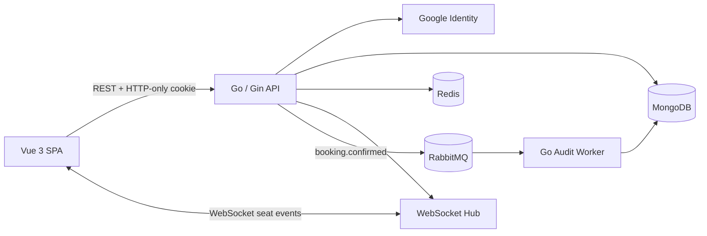

# Cinema Ticket Booking System

A cinema booking system focused on concurrency correctness. Users authenticate with Google, lock seats for a limited time, receive real-time seat updates, and confirm bookings without double booking. RabbitMQ moves audit logging out of the booking request path.

## 1. System Architecture Diagram



The API is the command boundary. MongoDB stores durable users, movies, showtimes, bookings, and audit logs. Redis stores temporary seat locks. The in-process WebSocket hub broadcasts seat state changes to clients subscribed to the same showtime. RabbitMQ delivers booking events to the audit worker.

## 2. Tech Stack Overview

| Layer | Technology | Purpose |
| --- | --- | --- |
| Backend | Go, Gin | REST API, authorization, booking orchestration |
| Frontend | Vue 3, TypeScript, Vite | Browser UI; currently only scaffolded |
| Authentication | Google ID Token, JWT | Identity verification and API sessions |
| Session transport | HTTP-only cookie | Prevent JavaScript access to the JWT |
| Database | MongoDB | Durable application state and transactions |
| Distributed lock | Redis | Atomic seat locks with a five-minute TTL |
| Realtime | Gorilla WebSocket | Seat status events scoped by showtime |
| Message queue | RabbitMQ | Durable asynchronous booking audit events |
| Worker | Go | Consumes events and writes audit logs |
| Local infrastructure | Docker Compose | MongoDB, Redis, and RabbitMQ |

## 3. Booking Flow

1. The frontend loads a showtime seat map through `GET /api/v1/showtimes/:showtimeID/seats`.
2. The frontend opens `/api/v1/ws/showtimes/:showtimeID/seats` and joins the showtime WebSocket room.
3. An authenticated user selects a seat and calls `POST /api/v1/showtimes/:showtimeID/seats/:seatCode/lock`.
4. The API verifies that the showtime is active and the seat is available.
5. Redis atomically creates the lock. The response contains a lock token and expiration time.
6. The API broadcasts a `seat.status_changed` event with status `LOCKED`.
7. The client confirms with `POST /api/v1/bookings/confirm`, including `showtime_id`, `seat_code`, and `lock_id`.
8. The service validates lock ownership in Redis.
9. A MongoDB transaction conditionally changes the seat from `AVAILABLE` to `BOOKED` and inserts the booking. Only one concurrent request can match the available seat.
10. After commit, the service releases the Redis lock, broadcasts `BOOKED`, and publishes a `booking.confirmed` event to RabbitMQ.
11. The worker consumes the event and stores an idempotent audit log. Failed non-retryable messages are routed to the dead-letter queue.
12. If the lock expires before confirmation, Redis emits an expiry event and the API broadcasts the current seat status as `AVAILABLE`.

## 4. Redis Lock Strategy

Seat locks use a key scoped to a showtime and seat:

```text
cinema:seat-lock:{showtime_id}:SEAT_CODE
```

The value contains both the user ID and a random lock ID. A user ID alone is insufficient because the same user may create multiple lock attempts.

### Acquire

```text
SET key "user_id|lock_id" NX PX 300000
```

- `NX` succeeds only when the key does not exist.
- `PX` gives the lock a server-side TTL in milliseconds.
- Repeated requests by the current owner return the existing lock and remaining TTL.

### Validate and release

Lua scripts compare the stored value with the expected `user_id|lock_id` before reading TTL or deleting the key. This prevents an expired owner from deleting a newer owner's lock.

### Final double-booking guard

Redis coordinates the temporary selection but is not the durable source of truth. Booking confirmation also uses a conditional MongoDB update that matches only an `AVAILABLE` seat. A unique booking index provides another guard against duplicate bookings.

## 5. Message Queue Usage

RabbitMQ handles asynchronous side effects after a booking is confirmed:

- Exchange: `cinema.events`
- Booking routing key: declared by the messaging topology
- Audit queue: `cinema.audit.events`
- Dead-letter exchange: `cinema.events.dlx`
- Dead-letter queue: `cinema.audit.events.dlq`

The API publishes persistent messages with publisher confirms and mandatory routing. The worker uses manual acknowledgements and a configurable prefetch count. Duplicate events are safe because audit logs are keyed by event ID. Invalid events are rejected without requeue; transient failures receive one retry before dead-lettering.

RabbitMQ does not prevent double booking. Redis and MongoDB own that responsibility.

## 6. Running the System

### Prerequisites

- Docker Desktop with Docker Compose
- Go version specified in [`backend/go.mod`](backend/go.mod)
- Node.js version supported by [`frontend/package.json`](frontend/package.json)
- A Google OAuth Web Client ID

### Environment files

The root `.env` supplies container credentials:

```dotenv
MONGO_ROOT_USERNAME=<mongo-root-user>
MONGO_ROOT_PASSWORD=<mongo-root-password>
MONGO_ROOT_PASSWORD_URI=<url-encoded-mongo-root-password>
MONGO_DATABASE=cinema_booking
ADMIN_EMAIL=<verified-google-account-email>
GOOGLE_CLIENT_ID=<google-oauth-client-id>
RABBITMQ_USER=cinema
RABBITMQ_PASSWORD=<rabbitmq-password>
API_PORT=9000
FRONTEND_PORT=5173
```

The API and worker read `backend/.env`. Required and relevant values include:

```dotenv
APP_PORT=8080
CORS_ALLOWED_ORIGINS=http://localhost:5173

MONGO_URI=mongodb://<user>:<url-encoded-password>@127.0.0.1:27017/?authSource=admin&replicaSet=rs0&directConnection=true
MONGO_DATABASE=cinema_booking

REDIS_ADDR=localhost:6380
REDIS_DB=0
SEAT_LOCK_TTL=5m

RATE_LIMIT_WINDOW=1m
RATE_LIMIT_AUTH=10
RATE_LIMIT_MUTATION=60
RATE_LIMIT_WEBSOCKET=20

RABBITMQ_URL=amqp://cinema:<password>@127.0.0.1:5672/
RABBITMQ_EXCHANGE=cinema.events
RABBITMQ_AUDIT_QUEUE=cinema.audit.events
RABBITMQ_DEAD_LETTER_EXCHANGE=cinema.events.dlx
RABBITMQ_AUDIT_DLQ=cinema.audit.events.dlq
RABBITMQ_PREFETCH=10
RABBITMQ_PUBLISH_TIMEOUT=3s

JWT_SECRET=<at-least-32-random-characters>
JWT_ISSUER=cinema-booking-api
JWT_ACCESS_TTL=15m
COOKIE_NAME=cinema_access_token
COOKIE_SECURE=false
COOKIE_SAME_SITE=lax
GOOGLE_CLIENT_ID=<google-oauth-client-id>
```

Do not commit real `.env` files. Use HTTPS, `COOKIE_SECURE=true`, and an appropriate SameSite/CSRF policy in production.

Create local environment files from the committed templates, then replace all
placeholder values:

```powershell
Copy-Item .env.example .env
Copy-Item backend/.env.example backend/.env
Copy-Item frontend/.env.example frontend/.env
```

`MONGO_ROOT_PASSWORD_URI` is the URL-encoded form of
`MONGO_ROOT_PASSWORD`; for example, `@` becomes `%40`.

In Google Cloud Console, add `http://localhost:5173` to **Authorized
JavaScript origins**. This application sends the Google ID token to the API;
it does not use an OAuth redirect endpoint.

### Start the complete system

From the repository root:

```powershell
docker compose up --build -d
docker compose ps
```

This single command starts MongoDB, Redis, RabbitMQ, the Go API, the audit
worker, and the Vue frontend. Open `http://localhost:5173`. The API readiness
endpoint is available at `http://localhost:9000/health/ready`.

If either host port is already occupied, override it for that run:

```powershell
$env:FRONTEND_PORT=8080
$env:API_PORT=9001
docker compose up --build -d
```

Compose also starts `audit-worker`. This process consumes RabbitMQ events and
writes them to MongoDB's `audit_logs` collection. Check it with:

```powershell
docker compose logs -f audit-worker
```

RabbitMQ Management UI is available at `http://localhost:15672`.

When `ADMIN_EMAIL` is set, `docker compose up` creates or updates that email in
MongoDB with role `ADMIN`. Use the same verified email to sign in with Google.
The first successful Google login attaches the Google identity to the seeded
record without replacing its admin role. The seed is idempotent and runs again
on later Compose starts.

### Start the API manually (optional development workflow)

```powershell
cd backend
go mod download
go run ./cmd/api
```

Health endpoints:

- `http://localhost:9000/health/live` checks that the API process is serving requests.
- `http://localhost:9000/health/ready` checks MongoDB, Redis, and RabbitMQ.
- `http://localhost:9000/health` remains an alias for the readiness check.

After Google login, send the returned `csrf_token` value in the
`X-CSRF-Token` header for authenticated `POST`, `PATCH`, and `DELETE`
requests. The API also stores the value in the non-HTTP-only
`cinema_access_token_csrf` cookie.

Every response includes `X-Request-ID`. Clients may send their own valid
`X-Request-ID` to correlate API, Redis, RabbitMQ, and worker logs. Rate-limited
responses return HTTP `429` with `Retry-After` and `X-RateLimit-*` headers.

### Run components manually (optional development workflow)

In a second terminal:

```powershell
cd backend
go run ./cmd/worker
```

Do not start a second local worker when the Compose `audit-worker` service is
already running. RabbitMQ distributes messages among consumers on the queue.

### Run backend tests

Run unit tests and static checks from `backend`:

```powershell
go test ./...
go vet ./...
```

The integration suite uses the MongoDB replica set, Redis, and RabbitMQ from
Docker Compose:

```powershell
$env:RUN_INTEGRATION_TESTS="1"
$env:MONGO_TEST_URI="mongodb://<user>:<url-encoded-password>@localhost:27017/?authSource=admin&replicaSet=rs0&directConnection=true"
$env:REDIS_TEST_ADDR="localhost:6380"
$env:RABBITMQ_TEST_URL="amqp://cinema:<url-encoded-password>@localhost:5672/"

go test -tags=integration ./tests/integration -v -count=1
```

### Start the frontend

In a third terminal:

```powershell
cd frontend
npm install
npm run dev
```

The Vue application is currently a scaffold and does not yet implement the complete booking UI.

### Verification

```powershell
cd backend
go test ./...
go vet ./...

cd ../frontend
npm run type-check
npm run test:unit -- --run
npm run build
```

## 7. Assumptions and Trade-offs

- Payment is mocked; no external payment gateway is required.
- Redis time and TTL are authoritative for temporary locks. Browser clocks are display-only.
- WebSocket events are notifications, not durable commands. Clients should reload the seat map after reconnecting.
- The WebSocket hub is in-process. Multiple API replicas would need Redis Pub/Sub or another shared event bus to fan out events across instances.
- Redis keyspace notifications are lossy during subscriber downtime. MongoDB remains the durable source of seat state.
- RabbitMQ uses at-least-once delivery, so consumers must remain idempotent.
- Publishing occurs after the MongoDB booking transaction. A process crash between commit and publish can lose an event; a transactional outbox is the production-grade solution.
- Booking confirmation uses a MongoDB transaction. The current Compose MongoDB service is standalone; transactions require a replica set. Configure a single-node replica set for local transaction testing and a multi-node replica set in production.
- The complete system runs through Compose. The API and frontend may also run
  as host processes during development.
- Admin authorization is enforced by backend role middleware. Frontend route guards are only a user-experience feature.

## API Summary

All routes use the `/api/v1` prefix.

| Area | Endpoints |
| --- | --- |
| Authentication | `POST /auth/google`, `POST /auth/logout`, `GET /auth/me` |
| Movies | `GET /movies`, `GET /movies/:movieID` |
| Showtimes | `GET /movies/:movieID/showtimes`, `GET /showtimes/:showtimeID` |
| Seats | `GET /showtimes/:showtimeID/seats`, `POST/DELETE .../:seatCode/lock` |
| Bookings | `POST /bookings/confirm`, `GET /bookings`, `GET /bookings/:bookingID` |
| Realtime | `GET /ws/showtimes/:showtimeID/seats` |
| Admin | Movie and showtime management under `/admin` |
